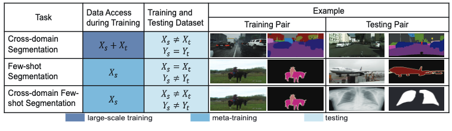

# Cross-Domain Few-Shot Semantic Segmentation (CD-FSS)

This is the implementation of the paper "Cross-Domain Few-Shot Semantic Segmentation". For more information, check out the [\[paper\]](https://slei109.github.io/papers/eccv-cdfss.pdf) and [\[supp\]](https://slei109.github.io/papers/eccv_cdfss_supp.pdf).

## Introduction

The Cross-Domain Few-Shot Semantic Segmentation includes data from the Deepglobe [1], ISIC2018 [2-3], Chest X-ray [4-5], and FSS-1000 [6] datasets, which covers satellite images, dermoscopic images of skin lesions, X-ray images, and daily objects respectively. The selected datasets reflect real-world use cases for few-shot learning since collecting enough examples from above domains is often difficult, expensive, or in some cases not possible. 

<p align="middle">
    
</p>
We study the CD-FSS problem, where the source and target domains have completely disjoint label space and cannot access target domain data during the training stage. 


## Datasets
The following datasets are used for evaluation in CD-FSS:

### Source domain: 

* **PASCAL VOC2012**:

    Download PASCAL VOC2012 devkit (train/val data):
    ```bash
    wget http://host.robots.ox.ac.uk/pascal/VOC/voc2012/VOCtrainval_11-May-2012.tar
    ```
    Download PASCAL VOC2012 SDS extended mask annotations from [[Google Drive](https://drive.google.com/file/d/10zxG2VExoEZUeyQl_uXga2OWHjGeZaf2/view?usp=sharing)].

### Target domains: 

* **Deepglobe**:

    Home: http://deepglobe.org/

    Direct: https://www.kaggle.com/datasets/balraj98/deepglobe-land-cover-classification-dataset
    
    Preprocessed Data: https://drive.google.com/file/d/10qsi1NRyFKFyoIq1gAKDab6xkbE0Vc74/view?usp=sharing

* **ISIC2018**:

    Home: http://challenge2018.isic-archive.com

    Direct (must login): https://challenge.isic-archive.com/data#2018
    
    Class Information: data/isic/class_id.csv

* **Chest X-ray**:

    Home: https://www.ncbi.nlm.nih.gov/pmc/articles/PMC4256233/

    Direct: https://www.kaggle.com/datasets/nikhilpandey360/chest-xray-masks-and-labels

* **FSS-1000**:

    Home: https://github.com/HKUSTCV/FSS-1000

    Direct: https://drive.google.com/file/d/16TgqOeI_0P41Eh3jWQlxlRXG9KIqtMgI/view

## Requirements

- Python 3.7
- PyTorch 1.5.1
- cuda 10.1
- tensorboard 1.14

Conda environment settings:
```bash
conda create -n patnet python=3.7
conda activate patnet

conda install pytorch=1.5.1 torchvision cudatoolkit=10.1 -c pytorch
conda install -c conda-forge tensorflow
pip install tensorboardX
```

## Training
> ### PASCAL VOC
> ```bash
> python train.py --backbone {vgg16, resnet50} 
>                 --fold 4 
>                 --benchmark pascal
>                 --lr 1e-3
>                 --bsz 20
>                 --logpath "your_experiment_name"
> ```

## Testing

> ### 1. Deepglobe
> ```bash
> python test.py --backbone {vgg16, resnet50} 
>                --benchmark deepglobe
>                --nshot {1, 5} 
>                --load "path_to_trained_model/best_model.pt"
> ```


> ### 2. ISIC
> ```bash
> python test.py --backbone {vgg16, resnet50} 
>                --benchmark isic 
>                --nshot {1, 5} 
>                --load "path_to_trained_model/best_model.pt"
> ```

> ### 3. Chest X-ray
> ```bash
> python test.py --backbone {vgg16, resnet50} 
>                --benchmark lung 
>                --nshot {1, 5} 
>                --load "path_to_trained_model/best_model.pt"
> ```

> ### 4. FSS-1000
> ```bash
> python test.py --backbone {vgg16, resnet50} 
>                --benchmark fss 
>                --nshot {1, 5} 
>                --load "path_to_trained_model/best_model.pt"
> ```

## Citation
If you use this code for your research, please consider citing:
```bash
@inproceedings{lei2022cross,
   title={Cross-Domain Few-Shot Semantic Segmentation},
   author={Lei, Shuo and Zhang, Xuchao and He, Jianfeng and Chen, Fanglan and Du, Bowen and Lu, Chang-Tien},
   booktitle={European Conference on Computer Vision},
   pages={73--90},
   year={2022},
   organization={Springer}
 }
 ```

## Acknowledgement
The implementation is based on [HSNet](https://github.com/juhongm999/hsnet). <br>

## References

[1] Demir, I., Koperski, K., Lindenbaum, D., Pang, G., Huang, J., Basu, S., Hughes,
F., Tuia, D., Raskar, R.: Deepglobe 2018: A challenge to parse the earth through
satellite images. In: The IEEE Conference on Computer Vision and Pattern Recog-
nition (CVPR) Workshops (June 2018)Li, X., Wei, T., Chen, Y.P., Tai, Y.W., Tang, C.K.: Fss-1000: A 1000-class dataset
for few-shot segmentation. In: Proceedings of the IEEE/CVF Conference on Com-
puter Vision and Pattern Recognition. pp. 2869–2878 (2020)

[2] Codella, N., Rotemberg, V., Tschandl, P., Celebi, M.E., Dusza, S., Gutman, D.,
Helba, B., Kalloo, A., Liopyris, K., Marchetti, M., et al.: Skin lesion analysis toward
melanoma detection 2018: A challenge hosted by the international skin imaging
collaboration (isic). arXiv preprint arXiv:1902.03368 (2019)

[3] Tschandl, P., Rosendahl, C., Kittler, H.: The ham10000 dataset, a large collection
of multi-source dermatoscopic images of common pigmented skin lesions. Scientific
data 5, 180161 (2018)

[4] Candemir, S., Jaeger, S., Palaniappan, K., Musco, J.P., Singh, R.K., Xue, Z.,
Karargyris, A., Antani, S., Thoma, G., McDonald, C.J.: Lung segmentation in
chest radiographs using anatomical atlases with nonrigid registration. IEEE trans-
actions on medical imaging 33(2), 577–590 (2013)

[5] Jaeger, S., Karargyris, A., Candemir, S., Folio, L., Siegelman, J., Callaghan, F.,
Xue, Z., Palaniappan, K., Singh, R.K., Antani, S., et al.: Automatic tuberculosis
screening using chest radiographs. IEEE transactions on medical imaging 33(2),
233–245 (2013)

[6] Li, X., Wei, T., Chen, Y.P., Tai, Y.W., Tang, C.K.: Fss-1000: A 1000-class dataset
for few-shot segmentation. In: Proceedings of the IEEE/CVF Conference on Com-
puter Vision and Pattern Recognition. pp. 2869–2878 (2020)

